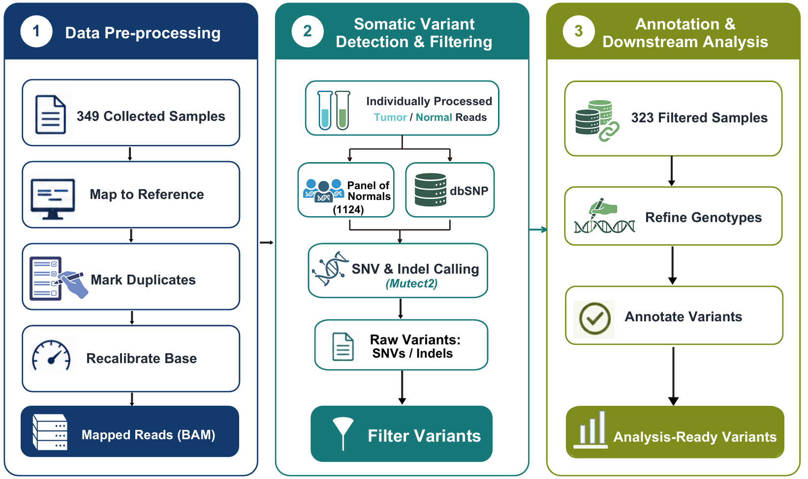

# -ctDNA-Mutation-Profiling-Reveals-Prognostic-Biomarkers-in-Breast-Cancer
ctDNA mutation profiling identifies plasma-derived prognostic biomarkers in breast cancer and supports a seven-gene survival risk model for liquid biopsy-based risk stratification.
## Workflow

This workflow summarizes the study design for ctDNA mutation profiling in breast cancer. Plasma-derived ctDNA mutation data and matched clinical annotations were integrated to characterize mutation patterns, evaluate clinicopathologic associations, identify candidate prognostic biomarkers, and construct a seven-gene survival risk model for liquid biopsy-based risk stratification.
