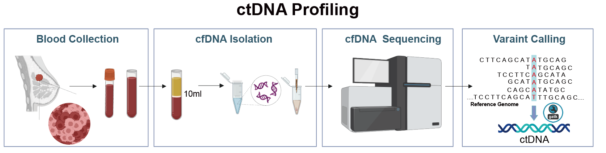

# ctDNA-Mutation-Profiling-Reveals-Prognostic-Biomarkers-in-Breast-Cancer
ctDNA mutation profiling identifies plasma-derived prognostic biomarkers in breast cancer and supports a seven-gene survival risk model for liquid biopsy-based risk stratification.
## Workflow

### cfDNA Workflow

This workflow summarizes the overall cfDNA study design, including sample collection, mutation profiling, clinical integration, biomarker screening, and survival risk model development.

### Mutect2 Analysis Workflow

This workflow summarizes the Mutect2-based somatic mutation calling process used for cfDNA BAM files, including sample metadata preparation, BAM indexing, Mutect2 calling, contamination estimation, filtering, ANNOVAR annotation, and final mutation table aggregation.
